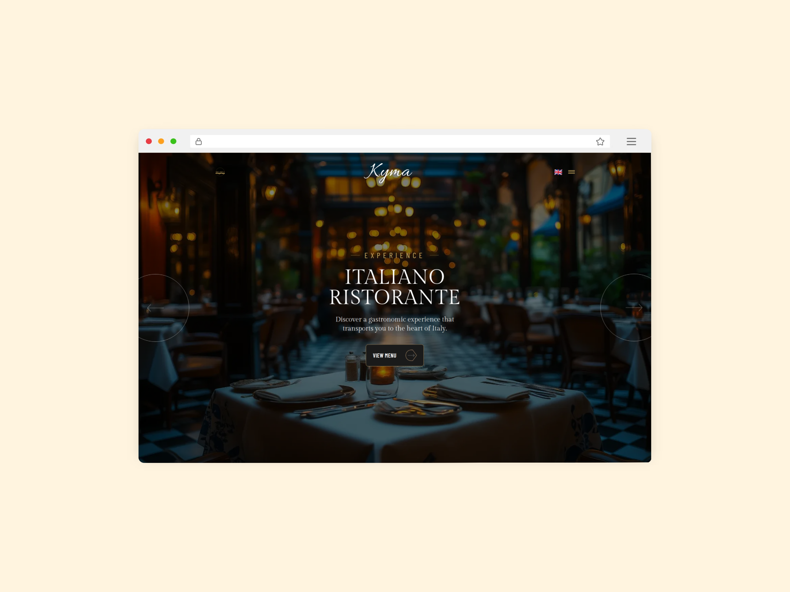

# Restaurant Next.js Template



A modern, multilingual restaurant website template built with Next.js 15, TypeScript, and Tailwind CSS.

## Features

- 🌍 **6 Languages**: English, Persian (RTL), Italian, Greek, Turkish, Russian
- 🎨 **Modern Design**: Elegant UI with smooth animations
- 📱 **Fully Responsive**: Mobile-first approach
- ⚡ **Fast Performance**: Optimized with Next.js 15 and Turbopack
- 🔍 **SEO Ready**: Multilingual sitemap and metadata
- � **Type Safe**: Full TypeScript support

## Tech Stack

- **Framework**: Next.js 15 (App Router)
- **Language**: TypeScript
- **Styling**: Tailwind CSS
- **i18n**: next-intl
- **Fonts**: Google Fonts (Gilda Display, Barlow, Barlow Condensed)

## Getting Started

```bash
# Install dependencies
npm install

# Run development server
npm run dev

# Build for production
npm run build

# Start production server
npm start
```

Open [http://localhost:3000](http://localhost:3000)

## Project Structure

```
src/
├── app/
│   ├── [locale]/          # Localized pages
│   └── sitemap.ts         # SEO sitemap
├── components/            # React components
├── lib/
│   └── api/              # API layer & types
├── data/
│   └── mockData/         # Mock data
├── i18n/                 # i18n configuration
└── middleware.ts         # Locale routing

messages/                  # Translation files
```

## Available Languages

- English (en) - Default
- Persian (fa) - RTL support
- Italian (it)
- Greek (el)
- Turkish (tr)
- Russian (ru)

## License

MIT

## Repository

[irzix/restaurant-nextjs](https://github.com/irzix/restaurant-nextjs)
